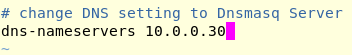

# Instalación y Configuración de dnsmasq

# Para la instalación y configuración hemos seguido los pasos de [la siguiente página](https://www.server-world.info/en/note?os=Debian_10&p=dnsmasq&f=1)

**Paso 1** 

Realizamos un apt update, en mi caso al tener los paquetes actualizados no me ha hecho falta por lo que hemos realizado directamente la instalación del paquete dnsmasq resolvconf

**Paso 2**

Una vez instalado realizamos la configuracion de los siguientes ficheros **/etc/dnsmasq.conf**, **/etc/network/interfaces**,**/etc/hosts**.

**Configuración /etc/dnsmasq.conf**

En este fichero lo que vamos a realizar más bien es descomentar las líneas **19, 21, 67, 135, 145**, en el caso de la línea 67 y 145 la hemos modificado con el sguiente contenido: *línea 67: server=/server.education/10.0.0.10* y en el caso de la *línea 145: domain=srv.world*. Una vez finalizado realizamos **systemctl restart dnsmasq**.

# Aquí podemos ver los pasos del fichero /etc/dnsmasq.conf:

**Configuración /etc/hosts**

En este fichero lo que vamos a introducir una nueva línea la cual va a penertenecer a dnsmasq y que contine lo siguiente: **10.0.0.30 dlp.svr.world dlp**, una vez finalizado la modificación hacemos de nuevo un **systemctl restart dnsmasq**.

# Aquí podemos ver los pasos del fichero /etc/hosts:

**Configuración /etc/network/interfaces**

A continuación en el fichero que vamos a configurar introducimos la siguiente línea: **dns-nameservers 10.0.0.30**.

# Aquí podemos ver los pasos del fichero /etc/network/interfaces:

**Importante en la página la cual he seguido para realizar la configuración nos recomienda hacer un systemctl restart ifup@ens2 resolvconf, no se ha realizado debido a un error que salía**.

